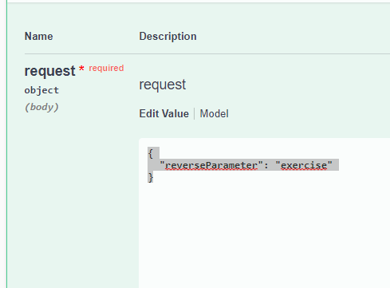

# simple_docker_app

This project contains  The project is based on a small web service which uses the following technologies:

* Java 11
* Spring Boot
* Maven
* Docker
* TDD

```bash

build: docker build -f Dockerfile -t demo:latest .
start with ports: docker container run -d --name demo-service -p 8080:8080  demo:latest
view all images : docker images 
view running images: docker ps ( docker container ls)

list container: docker container ls
start: docker container start demo-service 
stop : docker container stop demo-service 
delete: docker container rm demo-service


```
### How to check API

open
 ```[http://localhost:8080/swagger-ui/index.html#/](http://localhost:8080/swagger-ui/index.html#/)```

There is only one API and 1 method. You can use "Try it out" and send  sample request.


